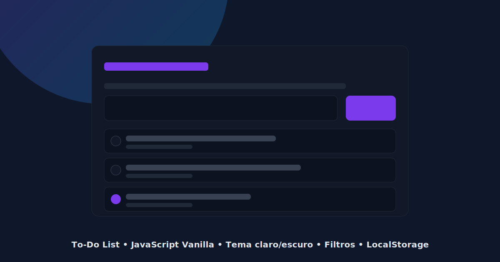

# To‑Do List — Vanilla JS

Um To‑Do List moderno, responsivo e profissional usando apenas HTML, CSS e JavaScript (ES6+ modular). Inclui tema claro/escuro, filtros, edição inline, animações e persistência completa com localStorage.



## 🧭 Visão Geral
- Interface limpa e responsiva
- Tema claro/escuro com CSS Custom Properties
- Microinterações (hover, focus, active)
- Animações de entrada e remoção (fade / slide)
- CRUD completo com LocalStorage
- Filtros: Todos / Ativos / Concluídos
- Edição inline (duplo clique)
- Contador de tarefas restantes
- Limpar concluídas

## 🗂️ Estrutura
```
/project
  index.html
  /css
     style.css
  /js
     app.js
     dom.js
     storage.js
     utils.js
  /assets
     preview.svg
     /icons
```

## 🛠️ Tecnologias
- HTML5 semântica
- CSS3 (Custom Properties, responsividade, animações)
- JavaScript ES6+ (módulos)
- Feather Icons (via CDN)

## 🚀 Como rodar
Abra o arquivo `project/index.html` no navegador.

No VS Code, você pode usar uma extensão de Live Server ou abrir um servidor estático:

```powershell
# PowerShell — serve a pasta "project" na porta 5500 com o npm serve (se tiver instalado)
# npm i -g serve
serve ./project -l 5500
```

Depois acesse: http://localhost:5500

## 📦 Persistência
- Tarefas são salvas em `localStorage` (chave `todo_tasks_v1`).
- Tema claro/escuro é salvo na chave `todo_theme_v1`.

## ✨ Funcionalidades
- Criar tarefa com validação de input
- Alternar concluída/ativa
- Editar com duplo clique (Enter confirma, Esc cancela)
- Remover com animação (slide + fade) antes de persistir
- Filtros e contador de pendentes
- Limpar concluídas
- Persistência após recarregar a página

## 🧩 Arquitetura de Módulos
- `app.js`: inicializa app, gerencia estado, coordena fluxo
- `dom.js`: renderização (lista, contadores, tema) e binding de eventos
- `storage.js`: localStorage (salvar/carregar/limpar) + geração de IDs
- `utils.js`: utilitários (formatação, validação, animações)

## 📸 Print
O arquivo `project/assets/preview.svg` ilustra a interface. Substitua por um print real depois, se desejar.

## 📜 Licença
Uso livre para portfólio e estudos.
